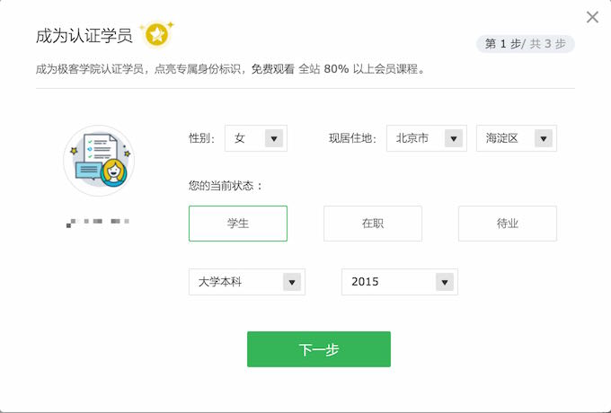
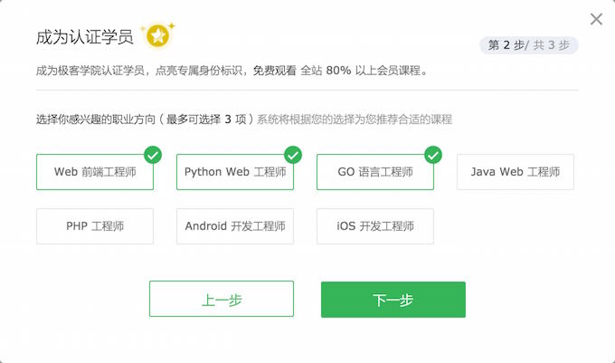
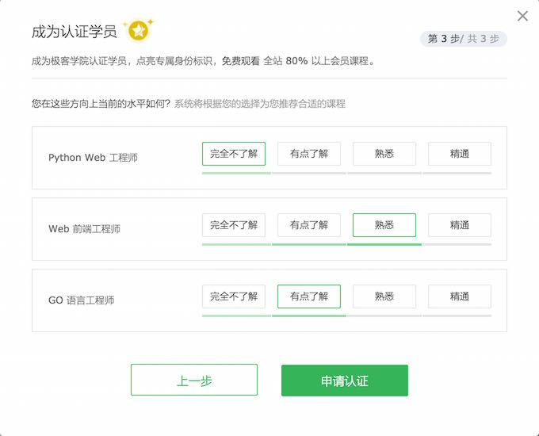

# 认证学员

## 什么是认证学员？

认证学员是极客学院用户的一种特殊身份，成为认证学员后，即可 **免费观看 80% 会员课程**，同时点亮用户头像上的黄色星标 。

## 怎样成为认证学员？

用户登录后，可以在 [账号设置 - 认证学员](http://my.jikexueyuan.com/setting/ca/) 申请认证。

完成认证需要三个步骤：

1. 填写基本信息和选择职业状态

2. 选择感兴趣的职业方向

3. 自评当前在感兴趣职业方向上的水平

## 认证学员和 VIP 会员有什么区别？

| 特权        | 认证学员   |  VIP 会员  |
|:--------   |:-----|:------|
| 观看会员课程     | 观看 80% 课程 |   观看全部课程    |
| 下载课程资料        |   不可下载   |   可下载   |
| 享受 VIP 价购买职业学院课程        |    否    |  是  |